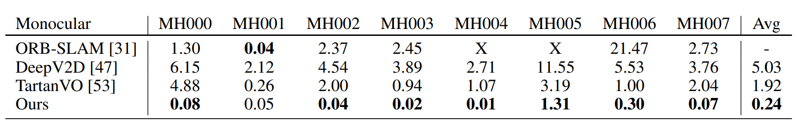

# Efficient View Path Planning for Autonomous Implicit Reconstruction

**Accepted by ICRA 2023 (EVPP).**


# NeurAR: Neural Uncertainty for Autonomous 3D Reconstruction With Implicit Neural Representations


**Accepted by RA-L 2023 (NeurAR).**

Project Page: [EVPP](https://small-zeng.github.io/EVPP/)

Paper Link: https://ieeexplore.ieee.org/abstract/document/10160793

GitHub Repo: https://github.com/small-zeng/EVPP

This project is built on [ashawkey/torch-ngp](https://github.com/ashawkey/torch-ngp)'s NGP and TensoRF implementation.

## Unity Project
百度云盘 https://pan.baidu.com/s/12lXVDL-f1cGk8O9LpVAzXA?pwd=j5ey

## Installation

```bash
git clone https://github.com/small-zeng/EVPP.git
cd EVPP
```

### Install with conda

```bash
conda env create -f environment.yml
conda activate EVPP
```

### Code Structure

The main entrances are `nerfServer_VPP`  and `planServre_VPP` .

`nerfServer_VPP`  defines the online implicit reconstruction.

`planServre_VPP` defines the view path planning.

## RUN

Follow the steps below to start autonomous implicit reconstruction:

1. Run Unity Project

``` 
After install Unity Editor and Visual Studio, you can start it by click `RUN` button in Unity Editor. (Start the childroom scene in default).
```

2. Open one terminal and start reconstruction service:

```bash
cd nerfServer_VPP
python manage.py runserver 0.0.0.0:6000
```

3. Open another terminal and start planner service:

```bash
cd planServre_VPP
python manage.py runserver 0.0.0.0:6100
```

4. In a web browser, start the planner by entering the link (10.15.198.53 is set according to IP of your host machine):

```bash
https://10.15.198.53:6100/isfinish/?finish=yes
```


## Performance

Reconstruction and Efficacy Metrics:


We obtain the pose using the Unity engine, and the pose can also be estimated by [Droid-SLAM](https://github.com/princeton-vl/DROID-SLAM), with the following metrics:




## BibTeX

```bibtex
@inproceedings{zeng2023efficient,
  title={Efficient view path planning for autonomous implicit reconstruction},
  author={Zeng, Jing and Li, Yanxu and Ran, Yunlong and Li, Shuo and Gao, Fei and Li, Lincheng and He, Shibo and Chen, Jiming and Ye, Qi},
  booktitle={2023 IEEE International Conference on Robotics and Automation (ICRA)},
  pages={4063--4069},
  year={2023},
  organization={IEEE}
}
```

## Acknowledgement

Use this code under the MIT License. No warranties are provided. Keep the laws of your locality in mind!

Please refer to [torch-ngp#acknowledgement](https://github.com/ashawkey/torch-ngp#acknowledgement) for the acknowledgment of the original repo.

