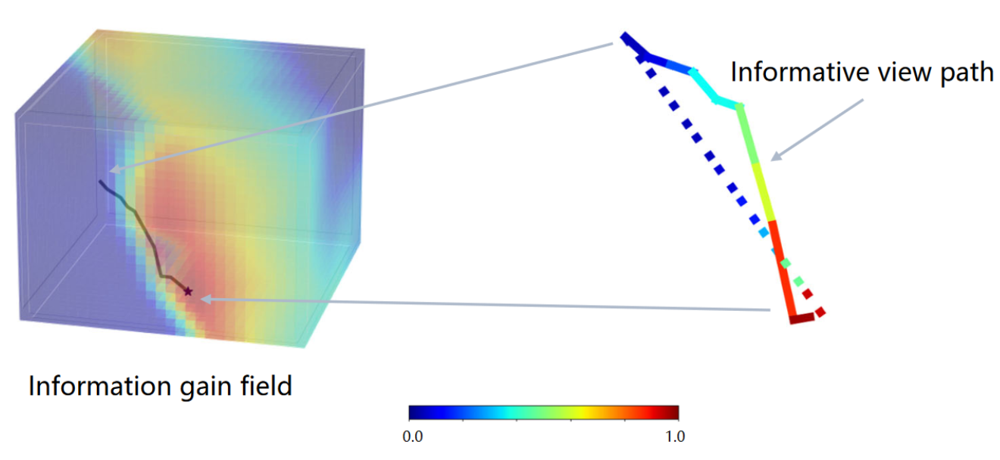
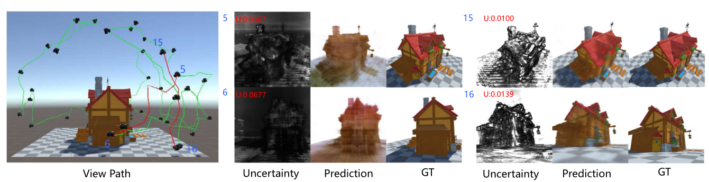
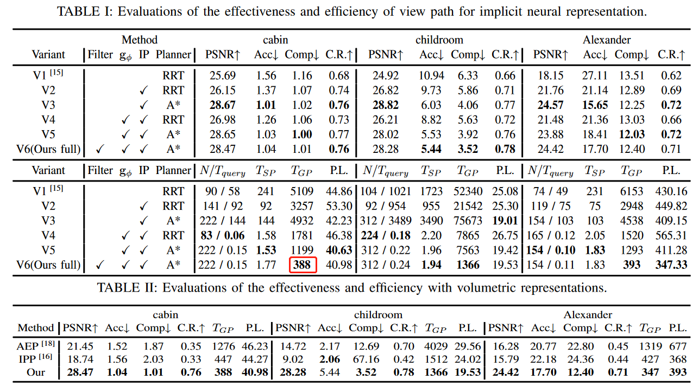

# Efficient View Path Planning for Autonomous Implicit Reconstruction

**Accepted by ICRA 2023 (EVPP).**



# NeurAR: Neural Uncertainty for Autonomous 3D Reconstruction With Implicit Neural Representations



**Accepted by RA-L 2023 (NeurAR).**

Project Page: [EVPP](https://small-zeng.github.io/EVPP/)  [NeurAR](https://kingteeloki-ran.github.io/NeurAR/) 

Paper Link: [EVPP](https://ieeexplore.ieee.org/abstract/document/10160793)  [NeurAR](https://ieeexplore.ieee.org/abstract/document/10012495/) 


This code is official implementation of the paper [Efficient View Path Planning for Autonomous Implicit Reconstruction (EVPP)](https://ieeexplore.ieee.org/abstract/document/10160793). It implements efficient autonomous implicit 3D reconstruction.

This project is built on [ashawkey/torch-ngp](https://github.com/ashawkey/torch-ngp)'s NGP and TensoRF implementation.


## Unity Project in Windows

Please refer to [Install Unity and Visual Studio on Windows](https://learn.microsoft.com/zh-cn/visualstudio/gamedev/unity/get-started/getting-started-with-visual-studio-tools-for-unity?pivots=windows). Our environment includes Unity 2019.4.40 and Visual Studio 2019. Please make sure installed environment is not lower than this version.

百度云盘: [cabin scene](https://pan.baidu.com/s/1c7toFyuyKOdV_ZKaJWS1LQ?pwd=g7jb)  [childroom scene](https://pan.baidu.com/s/1ke8hYxnlp7AMc-QCN29GIg?pwd=xsrz)

## Installation

```bash
git clone https://github.com/small-zeng/EVPP.git
cd EVPP
```

### Install with conda in Ubuntu

```bash
conda env create -f environment.yml
conda activate EVPP
```

### Code Structure

The main entrances are `nerfServer`  and `plannerServer_Object / plannerServer_Room` .

`nerfServer`  defines the online implicit reconstruction.

`plannerServer_Object / plannerServer_Room` defines the view path planning of single object scene and room scene.

## RUN

Follow the steps below to start autonomous implicit reconstruction:

1. Run Unity Project

```bash
After install Unity Editor and Visual Studio, you can start it by click RUN button in Unity Editor.
```

2. Open one terminal and start reconstruction service:

```bash
cd nerfServer
python manage.py runserver 0.0.0.0:6000
```

3. Open another terminal and start planner service:

Make sure that the Windows and Ubuntu machines are on the same local network. Set the IP address for sending views in the planner to your Windows IP. Modify [IP in plannerServer_Object](./plannerServer_Object/core/interface2.py#L26),  [IP in plannerServer_Room](./plannerServer_Room/core/interface2.py#L26).

```bash
cd plannerServer_Object / plannerServer_Room 
python manage.py runserver 0.0.0.0:6100
```

4. In a web browser, start the planner by entering the link (10.15.198.53 is set according to IP of your Ubuntu machine):

```bash
http://10.15.198.53:6100/isfinish/?finish=yes
```

## Test Data

百度云盘: [cabin scene](https://pan.baidu.com/s/1f0j3A9R2zcAZLVxM2lFdgw?pwd=x8j5)

Download the data above, unzip it, and place it in the directory: 
```bash
./nerfServer/logs
```

## Performance

### Effectiveness metrics

Download test data for rendering a circular view of the scene:

百度云盘: [cabin_traj](https://pan.baidu.com/s/15dqTtJJOVuyCHVaIuP04bw?pwd=33p2)

```bash
mkdir data
unzip cabin_traj
```

After 30 minutes of training, perform a complete rendering pass around the cabin scene:

百度云盘: [cabin_traj_render](https://pan.baidu.com/s/1qxZmQSgYjNC_TKbrNST-uQ?pwd=vnea)

```bash
cd nerfServer
python renderall.py
```


<p align="center">
  <a href="">
    
  </a >
</p >

**For the cabin scene (5m X 5m), the PSNR achieved after 30 minutes of reconstruction is 26.47.**

### Efficiency metrics

Planned results for cabin scene are in the path:

```bash
./plannerServer_Object/core/results
```



**For the cabin scene (5m X 5m), the planning time is 388 seconds.**


## BibTeX

```bibtex
@inproceedings{zeng2023efficient,
  title={Efficient view path planning for autonomous implicit reconstruction},
  author={Zeng, Jing and Li, Yanxu and Ran, Yunlong and Li, Shuo and Gao, Fei and Li, Lincheng and He, Shibo and Chen, Jiming and Ye, Qi},
  booktitle={2023 IEEE International Conference on Robotics and Automation (ICRA)},
  pages={4063--4069},
  year={2023},
  organization={IEEE}
}

@article{ran2023neurar,
  title={NeurAR: Neural Uncertainty for Autonomous 3D Reconstruction With Implicit Neural Representations},
  author={Ran, Yunlong and Zeng, Jing and He, Shibo and Chen, Jiming and Li, Lincheng and Chen, Yingfeng and Lee, Gimhee and Ye, Qi},
  journal={IEEE Robotics and Automation Letters},
  volume={8},
  number={2},
  pages={1125--1132},
  year={2023},
  publisher={IEEE}
}
```

## Acknowledgement

Use this code under the MIT License. No warranties are provided. Keep the laws of your locality in mind!

Please refer to [torch-ngp#acknowledgement](https://github.com/ashawkey/torch-ngp#acknowledgement) for the acknowledgment of the original repo.

